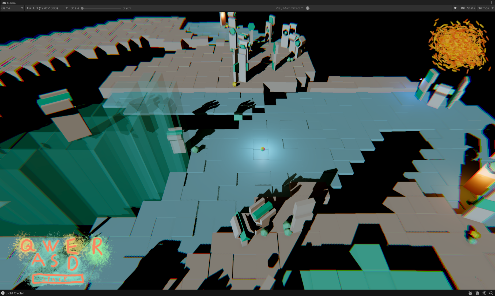
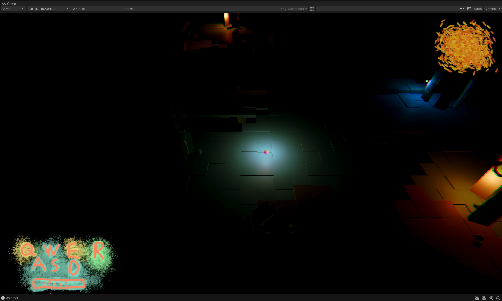
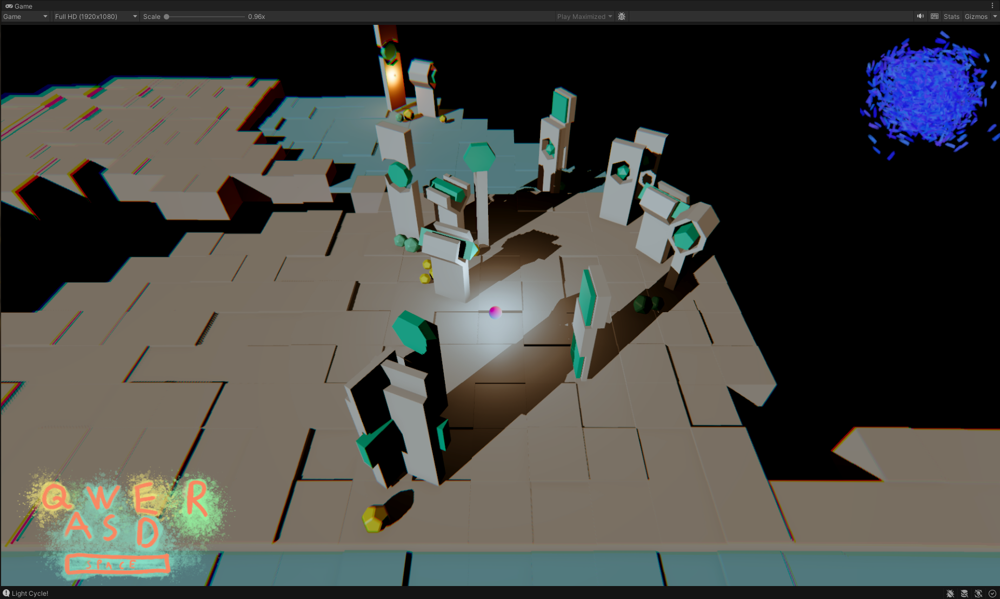
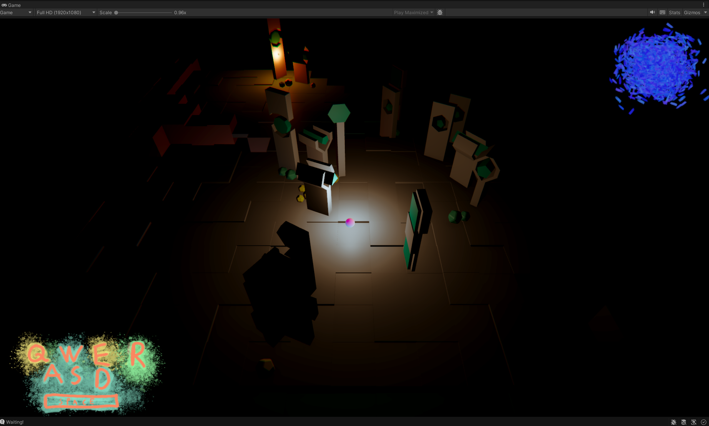
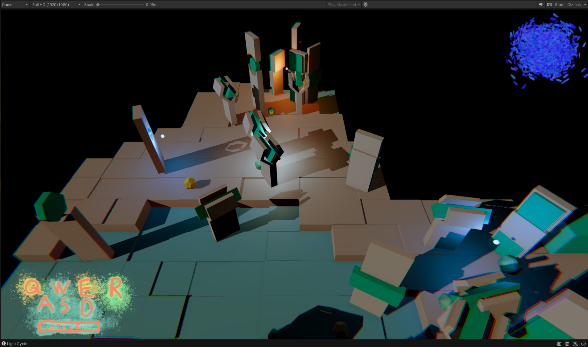
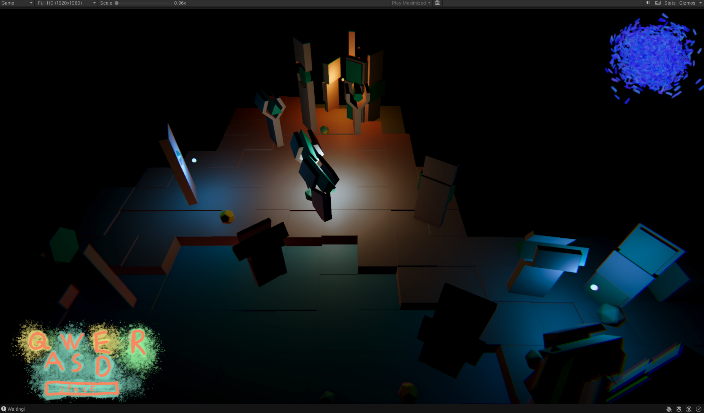

# Procedural Tiling Game

Play it on Itch.io: https://lovbos.itch.io/cold-warm-exploration-game

Game features:
* Fully playable prototype.
* Player by moving builds the map.
* Gameplay inspired by warm-cold game.
* Randomized and animated world map creation using Perlin noise.
* Randomized world props creation.
* Animated world creation.
* Animated creation of world props.
* Dynamic day and night cycle.
* Rigid-body player movement.
* Artistic Post-processing.
* Artistic models for world props.
* Parameterized world creation.

Tech stack:
* Unity 2022.3.13f1
* Blender 4.0.1
* Krita

### TODOs

* splash screen at game start
* splash screen at game end
* Enhance world generation
  * Add props/popups to specific blocks
  * Taller and lower world blocks
* enhance movement (less collisions)?
* enhance day-night cycle?
* Enhance colors and shapes?
* post processing?
* music - enhance audio tracks?