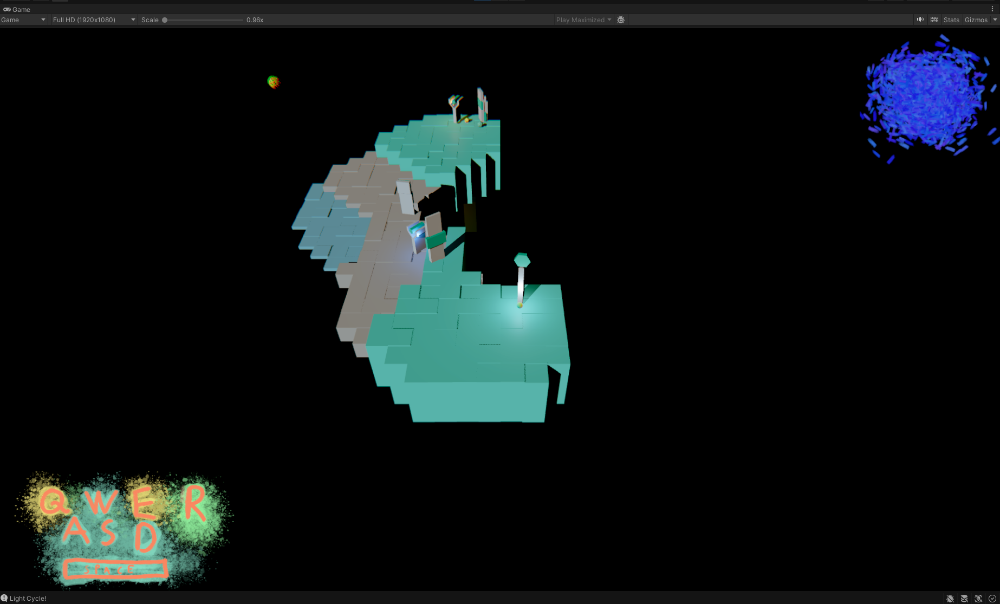

# Procedural Tiling Game

WIP

Unity 2022.3.13f1

Player by moving builds the map.

### TODOs

* Correct positioning of blocks, props and popups.
* Track all popups (now only last one is tracked)
* Taller and lower world blocks
* Player movement responding to World Blocks collisions
* Player movement responding to World props collisions
* Secondary animation while world blocks and props are built
* Better world blocks and world prop models (Blender and Houdini low poly)
* Enhancing usage of noise