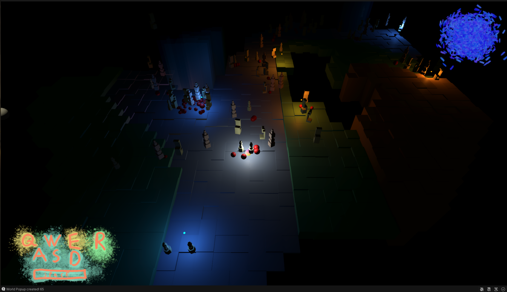

# Procedural Tiling Game

WIP

Unity 2022.3.13f1

Player by moving builds the map.

### TODOs

* Add Cold-warm gameplay
  * Add UI element: from red to blue depending on distance
  * Change light depending on distance
  * Game menu
  * game instances - randomize maps using `worldBlockJitter`
* Worldblocks do not have te be always instances - leave some empty ground?
* Add props/popups to specific blocks
* Track all popups (now only last one is tracked)
* Taller and lower world blocks
* Improve noise randomization
* Better world blocks and world prop models (Blender and Houdini low poly)
* Player: 
  * Light
* Light
  * world light
  * local lights